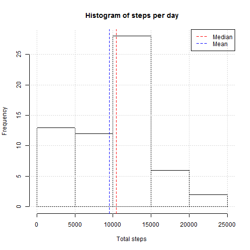
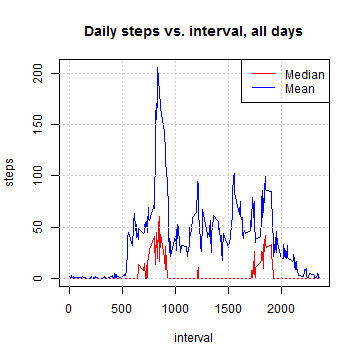
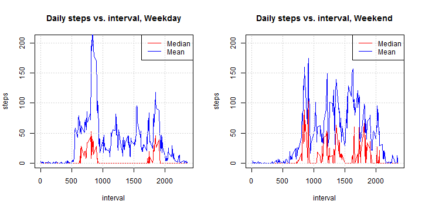

# Reproducible Research: Peer Assessment 1, Joseph 

## Loading and preprocessing the data


```r
date()
```

```
## [1] "Sun May 18 15:45:36 2014"
```

```r
library(plyr)
```

```
## Warning: package 'plyr' was built under R version 3.0.3
```

```r

basedir <- file.path("C:", "Users", "browse", "reproducibleresearch", "RepData_PeerAssessment1")
datadir <- file.path(basedir, "activity")
DA <- read.csv(file.path(datadir, "activity.csv"), as.is = TRUE)  # data frame
dim(DA)  # verify 17568 intervals in the data set
```

```
## [1] 17568     3
```

```r
head(DA, 15)  # examine the data
```

```
##    steps       date interval
## 1     NA 2012-10-01        0
## 2     NA 2012-10-01        5
## 3     NA 2012-10-01       10
## 4     NA 2012-10-01       15
## 5     NA 2012-10-01       20
## 6     NA 2012-10-01       25
## 7     NA 2012-10-01       30
## 8     NA 2012-10-01       35
## 9     NA 2012-10-01       40
## 10    NA 2012-10-01       45
## 11    NA 2012-10-01       50
## 12    NA 2012-10-01       55
## 13    NA 2012-10-01      100
## 14    NA 2012-10-01      105
## 15    NA 2012-10-01      110
```

```r
DA <- DA[order(DA$date, DA$interval), ]  # make sure that we are ordered!

# looks like interval is concatonated hour minutes, so have to separate:
DA$hour <- floor(DA$interval/100)
DA$minute <- DA$interval - 100 * DA$hour
DA$weekday <- weekdays(as.Date(DA$date))
DA$weekend <- ifelse(DA$weekday %in% c("Saturday", "Sunday"), "Weekend", "Weekday")
```


## What is mean total number of steps taken per day?
By linearity of sums, mean daily steps is the sum of the mean in each interval: 


```r
# get mean across all days for each interval, ignoring NAs:

# function to get interval characteristics (median and mean) of steps by
# date:
getDMM <- function(DA, append = "") {
    DMean <- ddply(DA, "interval", function(D) {
        mean(D$steps, na.rm = TRUE)
    })
    names(DMean) <- c("interval", paste("meansteps", append, sep = ""))
    
    DMedian <- ddply(DA, "interval", function(D) {
        median(D$steps, na.rm = TRUE)
    })
    names(DMedian) <- c("interval", paste("mediansteps", append, sep = ""))
    
    DMM <- merge(DMean, DMedian)
    return(DMM)
    
}

DMM <- getDMM(DA)
DMM.Weekend <- getDMM(subset(DA, weekend == "Weekend"), ".Weekend")
DMM.Weekday <- getDMM(subset(DA, weekend == "Weekday"), ".Weekday")
DMM <- merge(DMM, DMM.Weekend)
DMM <- merge(DMM, DMM.Weekday)


# impute missing values, substituting NAs with median values across all
# days:
DA$stepsB <- DA$steps
DB <- ddply(DA, "date", function(D) {
    D$stepsB[is.na(D$stepsB)] <- DMM$mediansteps[is.na(D$stepsB)]  # rely on order of intervals 
    return(D)
})


DD <- ddply(DB, "date", function(D) {
    sum(D$stepsB)
})  # summarize steps each day
names(DD) <- c("date", "dailysteps")
DD$weekday <- weekdays(as.Date(DD$date))
DD$weekend <- ifelse(DD$weekday %in% c("Saturday", "Sunday"), "Weekend", "Weekday")

hist(DD$dailysteps, xlab = "Total steps", main = "Histogram of steps per day")
abline(v = median(DD$dailysteps), col = "red", lty = 2)
abline(v = mean(DD$dailysteps), col = "blue", lty = 2)
grid()
legend("topright", lty = 2, col = c("red", "blue"), legend = c("Median", "Mean"))
```

 

```r

summary(DD$dailysteps)
```

```
##    Min. 1st Qu.  Median    Mean 3rd Qu.    Max. 
##      41    6780   10400    9500   12800   21200
```

```r
MeanStepsPerDay <- mean(DD$dailysteps)
MedianStepsPerDay <- median(DD$dailysteps)
```

Median steps Per Day: 10395
Mean steps Per Day: 9503.8689

## What is the average daily activity pattern?

```r
# summarize mean and median across all days

plot(DMM$interval, pmax(DMM$mediansteps, DMM$meansteps), type = "n", main = "Daily steps vs. interval, all days", 
    xlab = "interval", ylab = "steps")
lines(DMM$interval, DMM$mediansteps, col = "red")
lines(DMM$interval, DMM$meansteps, col = "blue")
grid()
legend("topright", lty = 1, col = c("red", "blue"), legend = c("Median", "Mean"))
```

 


## Imputing missing values

```r
Nnas <- sum(is.na(DA$steps))
Nrows <- dim(DA)[1]
```

In the original data, there were 2304 NAs out of 17568 intervals.
Imputation substituted median value across all days for each interval, in place of NAs.

## Are there differences in activity patterns between weekdays and weekends?
Yes, see the plot differences!

```r

par(mfrow = c(1, 2))

plot(DMM$interval, pmax(DMM$mediansteps, DMM$meansteps), type = "n", main = "Daily steps vs. interval, Weekday", 
    xlab = "interval", ylab = "steps")
lines(DMM$interval, DMM$mediansteps.Weekday, col = "red")
lines(DMM$interval, DMM$meansteps.Weekday, col = "blue")
grid()
legend("topright", lty = 1, col = c("red", "blue"), legend = c("Median", "Mean"))

plot(DMM$interval, pmax(DMM$mediansteps, DMM$meansteps), type = "n", main = "Daily steps vs. interval, Weekend", 
    xlab = "interval", ylab = "steps")
lines(DMM$interval, DMM$mediansteps.Weekend, col = "red")
lines(DMM$interval, DMM$meansteps.Weekend, col = "blue")
grid()
legend("topright", lty = 1, col = c("red", "blue"), legend = c("Median", "Mean"))
```

 

